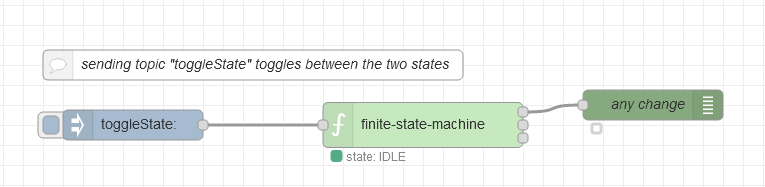

# Node Red State Machine

A finite state machine implementation for node red. Displays also a graphical representation of the state machine.


## Install in Node-RED

### In Node-RED

* Via Manage Palette -> Search for "node-red-contrib-finite-statemachine"

### In a shell

* go to the Node-RED installation folder, in OS X its usually: `~/.node-red`
* run `npm install node-red-contrib-finite-statemachine`

## Usage

### Input object elements
The inputs of the `finite state machine` are defined by a JSON object:

- *state* holds the initial state. It shall contain a *status* field and may contain a *data* object.
- *transitions* holds the possible states as keys (shown as upper case strings). As values it contains one or more key/value pairs, consisting of the transition string (lower case strings) and the resulting state.
- sending a `msg` to the node containing a `msg.topic` set to a transition string will trigger a state change.
- `msg.topic`= *reset* is a reserved transition to reset the machine to its initial state, so *reset* shall not be used as a transition name in the transition table.

### Output object elements

The `finite state machine` contains the following outputs: 

- *changed*: Outputs a  `msg` on flow startup and when there is any valid transition.
The latter is a transition to a different state or also a transition with the actual state in the `msg.topic` field.
- *statusChanged*: Outputs a `msg` only if the state machine has transitioned to a different state. At flow startup there is no output.
- *dataChanged*: Outputs a `msg` only if the data object is changed. This also happens in casae of a *reset* transition. At flow startup there is no output.

See example "Simple state machine with data object" for further explanation.

### Basic structure

```json
{
  "state": {
    "status": "IDLE",
    "data" : { "x": 5 }
  },
  "transitions": {
    "IDLE": {
      "run": "RUNNING"
    },
    "RUNNING": {
      "stop": "IDLE",
      "set": "RUNNING"
    }
  }
}
```

### Handling of the *"data"* object
- The data object in the "state" object is set to the defined value at the first start of the flow (initialization).
- The contents of the *data* object may be changed or extended by sending a `msg` with a valid transition (within `msg.topic`) containing a JSON object as payload. 

**Note:** Sending a `msg` without a valid transition cannot change the *data* object (see example below).


### Further information
Check Node-REDs info panel to see more information on how to use the state machine.


## Example flows

### Minimal state machine

This example shows a state machine with two states without any *data*-object.

There is only one `msg.topic` ("toggleState") which toggles between the two states IDLE and RUNNING.


```json
{
   "state": {
     "status": "IDLE"
   },
   "transitions": {
     "IDLE": {
       "toggleState": "RUNNING"
     },
     "RUNNING": {
       "toggleState": "IDLE"
     }
  }
}
```



```json
[{"id":"606ff60d.502dd","type":"tab","label":"Minimal state machine","disabled":false,"info":""},{"id":"a68cfab2.bbc9d8","type":"finite-state-machine","z":"606ff60d.502dd","name":"","fsmDefinition":"{\"state\":{\"status\":\"IDLE\"},\"transitions\":{\"IDLE\":{\"toggleState\":\"RUNNING\"},\"RUNNING\":{\"toggleState\":\"IDLE\"}}}","sendInitialState":false,"showTransitionErrors":true,"x":480,"y":240,"wires":[["debb4bee.65426"],[],[]]},{"id":"debb4bee.65426","type":"debug","z":"606ff60d.502dd","name":"any change","active":true,"tosidebar":false,"console":false,"tostatus":true,"complete":"payload","targetType":"msg","x":710,"y":220,"wires":[]},{"id":"1b3e4469.9e18bc","type":"inject","z":"606ff60d.502dd","name":"","topic":"toggleState","payload":"","payloadType":"str","repeat":"","crontab":"","once":false,"onceDelay":0.1,"x":190,"y":240,"wires":[["a68cfab2.bbc9d8"]]},{"id":"e6111ee1.cf3e6","type":"comment","z":"606ff60d.502dd","name":"sending topic \"toggleState\" toggles between the two states","info":"","x":310,"y":180,"wires":[]}]
```


### Simple state machine with data object

Set finite state machine definiton to:

```json
{
  "state": {
    "status": "IDLE",
    "data" : { "x": 5 }
  },
  "transitions": {
    "IDLE": {
      "run": "RUNNING"
    },
    "RUNNING": {
      "stop": "IDLE",
      "set": "RUNNING"
    }
  }
}
```
#### State description
This example gives a state machine with two states (IDLE, RUNNING) and three transitions. Two of them (*run*, *stop*) change between the two states, the third (*set*) is used only to change the *data* object contents in the state RUNNING.

#### Output behaviour
The difference between the outputs *"any change"* and *"status changed"* can be seen in *state* "RUNNING": In case of a `msg` with`msg.topic`= "set" the output *"any change"* sends a `msg`, output *"status changed"* does not send a `msg`.
The output *"data changed"* can only send a `msg` in the state "RUNNING" via the lower two inject nodes: They are able to change the value of the "data" variables and therefore output a `msg` to the outputs *"any change"* and *"data changed"* (but not at output *"status changed"*).


```json
[{"id":"378a3460.e755fc","type":"tab","label":"Simple state machine with data object","disabled":false,"info":""},{"id":"67adcdd8.8b41d4","type":"finite-state-machine","z":"378a3460.e755fc","name":"","fsmDefinition":"{\"state\":{\"status\":\"IDLE\",\"data\":{\"x\":5}},\"transitions\":{\"IDLE\":{\"run\":\"RUNNING\"},\"RUNNING\":{\"stop\":\"IDLE\",\"set\":\"RUNNING\"}}}","sendInitialState":false,"showTransitionErrors":true,"x":600,"y":260,"wires":[["1a35a82.2e59ad8"],["324d3672.55ac32"],["b85f26d6.b8f418"]]},{"id":"1a35a82.2e59ad8","type":"debug","z":"378a3460.e755fc","name":"any change","active":true,"tosidebar":true,"console":false,"tostatus":false,"complete":"payload","targetType":"msg","x":830,"y":220,"wires":[]},{"id":"c882ea0f.8236e","type":"inject","z":"378a3460.e755fc","name":"","topic":"reset","payload":"","payloadType":"str","repeat":"","crontab":"","once":true,"onceDelay":0.1,"x":210,"y":120,"wires":[["67adcdd8.8b41d4"]]},{"id":"4117af3.0c6505","type":"comment","z":"378a3460.e755fc","name":"sending topic \"reset\" will set the state machine to its initial state","info":"","x":380,"y":80,"wires":[]},{"id":"324d3672.55ac32","type":"debug","z":"378a3460.e755fc","name":"status change","active":true,"tosidebar":true,"console":false,"tostatus":false,"complete":"payload","targetType":"msg","x":840,"y":260,"wires":[]},{"id":"b85f26d6.b8f418","type":"debug","z":"378a3460.e755fc","name":"\"data\" change","active":true,"tosidebar":true,"console":false,"tostatus":false,"complete":"payload","targetType":"msg","x":840,"y":300,"wires":[]},{"id":"976ee3eb.97e4f","type":"inject","z":"378a3460.e755fc","name":"","topic":"run","payload":"","payloadType":"str","repeat":"","crontab":"","once":false,"onceDelay":0.1,"x":210,"y":240,"wires":[["67adcdd8.8b41d4"]]},{"id":"7ae46f5b.127bc8","type":"inject","z":"378a3460.e755fc","name":"","topic":"set","payload":"{\"x\" : 2, \"name\" : \"peter\"}","payloadType":"json","repeat":"","crontab":"","once":false,"onceDelay":0.1,"x":280,"y":400,"wires":[["67adcdd8.8b41d4"]]},{"id":"4fa32a8f.24719c","type":"inject","z":"378a3460.e755fc","name":"","topic":"set","payload":"{\"y\" : 3}","payloadType":"json","repeat":"","crontab":"","once":false,"onceDelay":0.1,"x":230,"y":440,"wires":[["67adcdd8.8b41d4"]]},{"id":"1622d35c.3a4f1d","type":"comment","z":"378a3460.e755fc","name":"any other topic will trigger a transition","info":"","x":290,"y":200,"wires":[]},{"id":"1196d485.ba7693","type":"inject","z":"378a3460.e755fc","name":"","topic":"stop","payload":"","payloadType":"str","repeat":"","crontab":"","once":false,"onceDelay":0.1,"x":210,"y":280,"wires":[["67adcdd8.8b41d4"]]},{"id":"1e02858b.9b841a","type":"comment","z":"378a3460.e755fc","name":"by sending a JSON object as payload you can add data to the state","info":"","x":380,"y":360,"wires":[]}]
```


### State machine with feedback flow

Set finite state machine definiton to:

```json
{
  "state": {
    "status": "IDLE"
  },
  "transitions": {
    "IDLE": {
      "run": "RUNNING"
    },
    "RUNNING": {
      "stop": "IDLE"
    }
  }
}
```

This example gives a self-stopping behaviour after a defined amount of time: Transition *run* triggers the state machine to *state* RUNNING, the feedback loop activates the transition *stop* after a delay of 5 seconds so that the state machine changes back to *state* IDLE.


```json
[{"id":"e7cbb08b.ea53","type":"tab","label":"State machine with feedback flow","disabled":false,"info":""},{"id":"b4a9f9f7.51a2a8","type":"finite-state-machine","z":"e7cbb08b.ea53","name":"","fsmDefinition":"{\"state\":{\"status\":\"IDLE\",\"data\":{\"x\":5}},\"transitions\":{\"IDLE\":{\"run\":\"RUNNING\"},\"RUNNING\":{\"stop\":\"IDLE\",\"set\":\"RUNNING\"}}}","sendInitialState":false,"showTransitionErrors":true,"x":480,"y":160,"wires":[["d6bb83dc.a1bad8"],[],[]]},{"id":"8c71a3b6.8311d","type":"inject","z":"e7cbb08b.ea53","name":"","topic":"run","payload":"","payloadType":"str","repeat":"","crontab":"","once":false,"onceDelay":0.1,"x":270,"y":160,"wires":[["b4a9f9f7.51a2a8"]]},{"id":"d6bb83dc.a1bad8","type":"switch","z":"e7cbb08b.ea53","name":"onRUNNING","property":"payload.status","propertyType":"msg","rules":[{"t":"eq","v":"RUNNING","vt":"str"}],"checkall":"true","repair":false,"outputs":1,"x":690,"y":140,"wires":[["d3e923f3.8d2478"]]},{"id":"d3e923f3.8d2478","type":"delay","z":"e7cbb08b.ea53","name":"delay 5s","pauseType":"delay","timeout":"5","timeoutUnits":"seconds","rate":"1","nbRateUnits":"1","rateUnits":"second","randomFirst":"1","randomLast":"5","randomUnits":"seconds","drop":false,"x":760,"y":300,"wires":[["d1f104bf.095cf8"]]},{"id":"d1f104bf.095cf8","type":"change","z":"e7cbb08b.ea53","name":"set msg.topic to stop","rules":[{"t":"set","p":"topic","pt":"msg","to":"stop","tot":"str"}],"action":"","property":"","from":"","to":"","reg":false,"x":220,"y":200,"wires":[["b4a9f9f7.51a2a8"]]},{"id":"d90fb97c.0299d8","type":"comment","z":"e7cbb08b.ea53","name":"sending topic \"run\" will trigger the machine which is stopped 5 seconds later","info":"","x":390,"y":100,"wires":[]}]
```


### Changing the "data" object

The *data* object can only be changed or extended during a valid transition. I.e. the JSON object contents sent in a `msg` containing no valid transition within the `msg.topic` does not lead to any *data* object changes.

Therefore see example "State machine with feedback flow" above: To be able to change the *data* object in the *state* RUNNING, the transition *run* is defined: This transition does not change the *state* but may change the *data* object within *state* RUNNING like the two lower injections do.
In the example the definition of the upper set injection is like follows:


As can seen this changes the present "data" object element "x" to a numerical value of '2' and adds an additional "data" object element "name" with the string "peter".


## Development

* run `npm install`
* install grunt `npm install -g grunt-cli`
* build with `npm run build`
