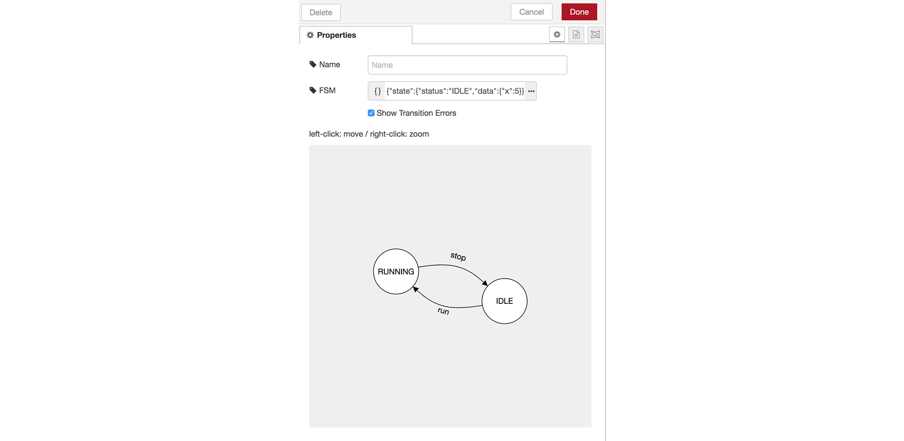
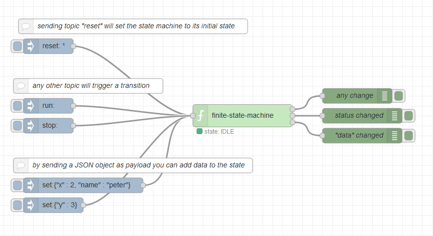
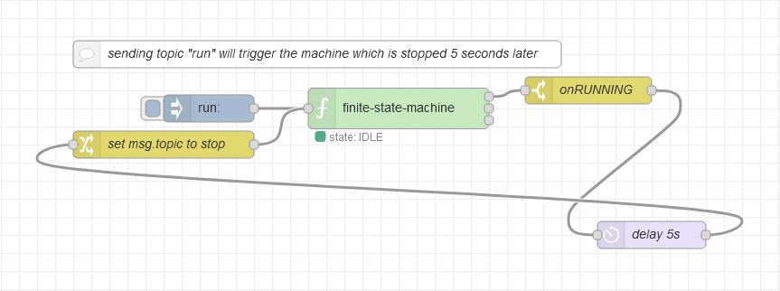

# Node Red Statemachine

A finite state machine implementation for node red. Displays also a graphical representation of the state machine.



## Install in Node Red

### In Node-red

* Via Manage Palette -> Search for "node-red-contrib-finite-statemachine"

### In Terminal

* go in node-red install folder, in os x its usually: `~/.node-red`
* run `npm install node-red-contrib-finite-statemachine`

## Usage

The statemachine is defined by a json object:

- *state* holds the initial state. It needs to contain a *status* field and might contain a *data* object.
- *transitions* holds the possible states as Keys (the upper case strings). As Values it holds one or more Key-Value Pairs, consisting of the transition (lower case strings) and the resulting state.
- sending a msg with the topic set to the transition string to the node will trigger a state change.
- *reset* is a reserved transition to reset the machine to its initial state, so it cannot be used in the transition table.


```javascript
{
  "state": {
    "status": "IDLE",
    "data" : { "x": 5 }
  },
  "transitions": {
    "IDLE": {
      "run": "RUNNING"
    },
    "RUNNING": {
      "stop": "IDLE",
      "set": "RUNNING"
    }
  }
}
```

Check node-reds info panel to see more information on how to use the state machine.


## Example flows

### Simple statemachine with data object

Set finite state machine definiton to:

```javascript
{
  "state": {
    "status": "IDLE",
    "data" : { "x": 5 }
  },
  "transitions": {
    "IDLE": {
      "run": "RUNNING"
    },
    "RUNNING": {
      "stop": "IDLE",
      "set": "RUNNING"
​   }
  }
}
```




### Statemachine with feedback flow

Set finite state machine definiton to:

```javascript
{
  "state": {
    "status": "IDLE"
  },
  "transitions": {
    "IDLE": {
      "run": "RUNNING"
    },
    "RUNNING": {
      "stop": "IDLE"
    }
  }
}
```



## Development

* run `npm install`
* install grunt `npm install -g grunt-cli`
* build with `npm run build`
